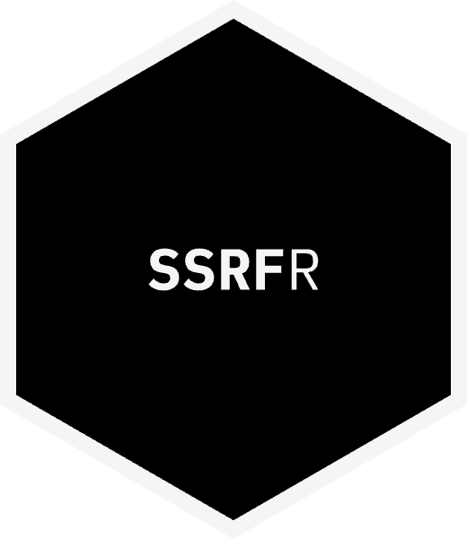

---
output:
  github_document:
    html_preview: false
---

<!-- README.md is generated from README.Rmd. Please edit that file -->

# ssrfr 

<!-- badges: start -->
<!-- The row follows seor's design/fleet-standard.md, "Badge row". ssrfr is off
     CRAN with no GitLab Release and no concept DOI yet, so r-universe takes
     slot 1 and the CRAN, latest-release, DOI and dependencies badges are left
     out until each condition holds. The FOSSA pair is slot 17: ssrfr is one of
     the three FOSSA packages. FOSSA keys the project under the account's
     custom+62973/ prefix, and it appears after the first `fossa analyze` run
     on main. -->
[](https://bart-turczynski.r-universe.dev/ssrfr)
[](https://gitlab.com/bart-turczynski/ssrfr/-/pipelines)
[](https://gitlab.com/bart-turczynski/ssrfr/-/pipelines)
[](https://bart-turczynski.gitlab.io/ssrfr/)
[](https://lifecycle.r-lib.org/articles/stages.html#experimental)
[](https://www.repostatus.org/#active)
[](https://zenodo.org/search?q=metadata.creators.person_or_org.identifiers.identifier:0000-0002-8788-7980)
[](https://www.bestpractices.dev/projects/15191)
[](https://gitlab.com/bart-turczynski/ssrfr/-/blob/main/LICENSE.md)
[](https://gitlab.com/bart-turczynski/ssrfr/-/commits/main)
[](https://app.fossa.com/projects/custom%2B62973%2Fgit%2Bgitlab.com%2Fbart-turczynski%2Fssrfr?ref=badge_shield&issueType=license)
[](https://app.fossa.com/projects/custom%2B62973%2Fgit%2Bgitlab.com%2Fbart-turczynski%2Fssrfr?ref=badge_shield&issueType=security)
<!-- badges: end -->

Server-side request forgery (SSRF) protection for R applications that fetch URLs
an attacker can influence: `plumber` endpoints, Shiny apps, webhook receivers,
crawlers following redirects.

`ssrfr` guards one hop at a time. `ssrf_prepare_hop()` parses a URL, resolves
its name once, classifies every address the name resolves to, and returns
a refusal with a stable reason code, an operational failure, or a binding
pinned to the validated addresses. `ssrf_fetch()` fetches through that binding
and connects only to a validated address, so the name cannot be rebound between
the check and the connection. A redirect is followed by preparing the next hop from the previous
one, which checks it from the start, or by `ssrf_fetch_chain()`, which runs that
loop for you.

By default only `http` and `https` on ports 80 and 443 are allowed, and every
address a name resolves to must be public: loopback, private, link-local,
multicast and reserved addresses, cloud metadata endpoints and hostnames, and
addresses that embed or translate to such an address are refused, as are URLs
with credentials and URLs the two parsers read differently. One refused address
refuses the whole answer. `ssrf_policy()` opens or closes schemes, ports, hosts
and address ranges, and sets the redirect, time and size limits.

Parsing comes from [`rurl`](https://gitlab.com/bart-turczynski/rurl) and
libcurl, address classification from
[`raddr`](https://gitlab.com/bart-turczynski/raddr).

## Installation

`ssrfr` is not on CRAN yet. Install it from r-universe:

```r
install.packages(
  "ssrfr",
  repos = c("https://bart-turczynski.r-universe.dev", "https://cloud.r-project.org")
)
```

Or install the development version from GitLab:

```r
# install.packages("remotes")
remotes::install_gitlab("bart-turczynski/ssrfr")
```

## Usage

```r
library(ssrfr)

policy <- ssrf_policy(max_redirects = 5)

# Follow a whole redirect chain through the guard.
result <- ssrf_fetch_chain("https://example.com/", policy, request = list())

# A refusal is a value with a reason code, not an error.
refused <- ssrf_fetch_chain(
  "http://169.254.169.254/latest/",
  policy,
  request = list()
)
refused$code
#> [1] "cloud-metadata"

# Show an untrusted party only the public projection.
ssrf_public_reason(refused)
#> [1] "refused"
```

`ssrf_inspect_url()` reports what a URL is under a policy, with no network I/O
or with one resolution. It is a pre-filter and a way to lint a configuration,
not a defense. `ssrf_vocabulary()` lists the reason codes, operational causes
and error classes, which are a closed, versioned vocabulary you can log and
match on.

The
[introduction](https://bart-turczynski.gitlab.io/ssrfr/articles/introduction.html)
walks through the policy, the guarded hop, redirects and testing against a
local server. It is also the package vignette, but `install_gitlab()` builds no
vignettes unless you pass `build_vignettes = TRUE`. The documentation site is
<https://bart-turczynski.gitlab.io/ssrfr/>.

## What it does not protect

`ssrfr` is defense in depth. It does not replace egress firewalls or network
isolation, and it cannot protect code that fetches through R's unguarded
primitives (`download.file()`, `url()`, direct `curl` or `httr2` calls). Only
requests made through a binding are guarded.

The contract `ssrfr` implements is its
[v1 specification](https://gitlab.com/bart-turczynski/ssrfr/-/blob/main/design/specs/ssrfr-v1.md).
To report a vulnerability, see
[`SECURITY.md`](https://gitlab.com/bart-turczynski/ssrfr/-/blob/main/SECURITY.md).
